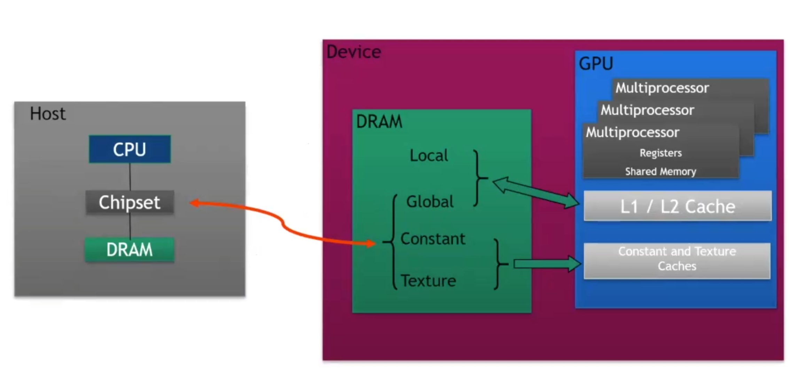
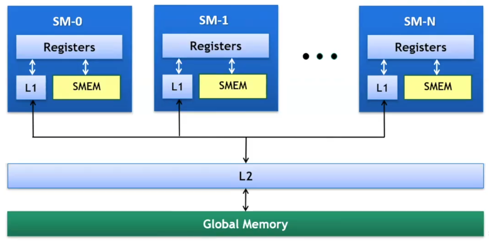
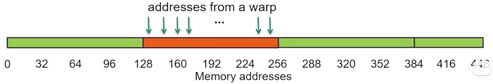
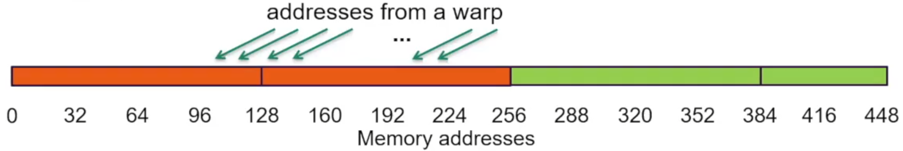
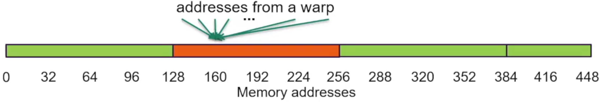
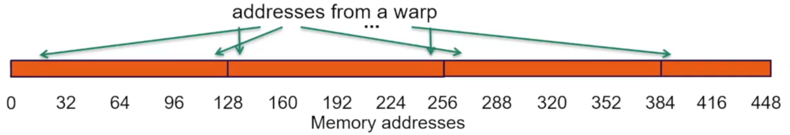
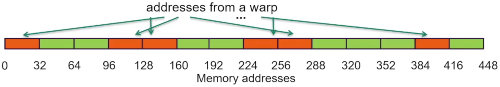
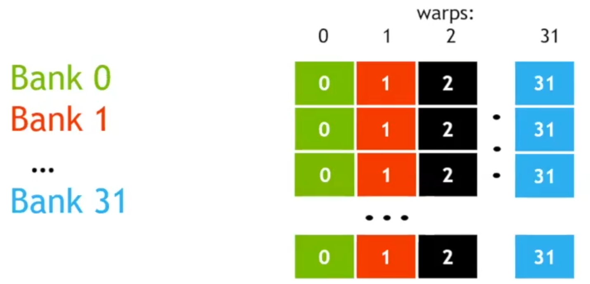
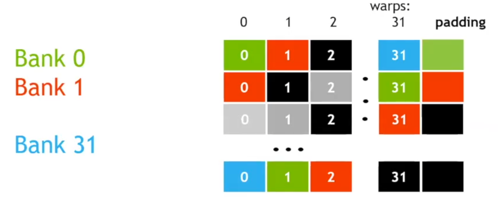

# lec4-CUDA optimization Part2

前面几节课已经讲了基础的cuda内核编写的一些语法规则和示例。
在这节课我们重点关注“运行速度”，这是使用cuda编程的重中之重，毕竟使用gpu的目的，一言以蔽之，就是加速我们的程序。在上一次的课程中已经讨论了第一个CUDA优化项的内容，那就是有关使用线程的数量——总得来说，我们希望运行尽可能多的线程，来填满gpu的算力，具体选择会根据gpu的架构有所不同。

这次课程我们来关注第二个cuda优化项：高效地使用gpu上的存储子系统。（大概就是共享内存shared memory？）

这两个优化项是实现性能优化的两个最重要的因素。（区别于分析驱动analysis-driven的优化，也就是实际使用中根据实地反馈进行的细致调优，和分析器profiler相关）

---

## GLOBAL MEMORY THROUGHPUT

我们可以从小到大（指工作范围）的来看一下gpu的存储层级架构：

- 本地存储 Local storage：每个线程都会有属于其自己的本地存储，一般来说就是寄存器 regsiters，具体何使用寄存器则由编译器 compiler来决定。  
- 共享内存 shared memory：由同一个区块 block内的线程共同使用，分配大约48KB，这和具体架构有关，也可能是64KB，96KB，等等。有着低延迟和高吞吐量的特点，后者可以干到1TB/s。可以人工显示管理。  
- L1缓存：作为缓存模块，用于加速一个SM上所有线程的内存访问，是一个每线程块资源 per thread block resource  
- L2缓存：同样作为缓存模块，与L1区别，是设备范围的资源 device-wide resource。是GPU共享的最后一级缓存，由所有SM共同使用，逻辑上属于全局共享，和L1一样不受人工管理  
- 全局内存 Global memory：这是一个可以由全体线程，包括主机（CPU）共同访问的模块，也是最后的，最大的层级元素，高延迟和低吞吐自不必多说，吞吐量在900GB/s左右（Volta V100），虽然与GPU架构中其他元素相比很低，但和其他类型的处理器相比已经是鹤立鸡群（典型的CPU内存带宽只有40-80GB/s）  

这是一个更直观的GPU内部的层级图。

当我们讨论性能优化的时候，一般来说就是Load和Store，GPU上的读写和传统CPU上的架构类似，用两级的缓存加速load，然后store的时候涉及一个validate当前L1-cache和L2-cache上的写回 write-back机制来实现效率和准确率的统一。不同的是这里的Load在使用L1-cache的情况下以128-byte的line为单位进行读操作。

同时gpu上有一种non-caching load，也就是忽略掉L1-cache来进行Load操作。由于L1-cache以block为单位，在一些corner situation中，这会有更好的效果。这种情况下以32-byte为单位。这里先按下不表。

---

### LOAD OPERATION

gpu上的所有操作都是以warp(32 threads)为单位来进行的，load也不例外。注意这并不意味着说每个thread都在请求同样的东西，32个threads可以有32个不同的address传入，从而请求load不同的内存。

在每一个thread提供load目标地址之后，系统需要做的事情是确定需要取缓存中的哪些line。更底层的，是去找需要取出哪些segment。这首先要求我们做一个凝聚 colaescing，将warp的request包装成一个完成的Load需求传给内存控制器，比如一串连续的地址请求，就可以包装成读取一整串line（见下面的第一幅图

> 区分一下line和segment：  
> line 一般指cache-line，是在L1/L2缓存中存储数据的基本单位，在大部分gpu上是128bytes，是操作cache的最小单位  
> segment 是在某个层次上（比如dram/L2-bus）上，一次内存事务可以操作的最小连续字节，一般是32bytes，是一个偏向硬件内存控制器的一个“基本块”的概念  
> 所以说在处理存取事务的时候，我们实际关注的是segment，Line则是我们后续进行凝聚 colaescing要关注的一个面向缓存的单位  

这将涉及到一个地址的映射 mapping操作，会交由内存控制器来完成，并决定是否从缓存中取数据。

下面来看几种常见的load模式：

这种情况下，我们假设warp请求了32个连续且与内存地址对齐的4-byte内容，也就是一共请求了128byte，正好对上一个完整的cache-line。同时我们假设一种最好的情况那就是其和一个line完整对齐，这个时候直接取这个完整的line就可以刚刚好取出所有需要的数据。

这是我们计算总线利用率应该是100%，也即128/128=100%。

在没那么理想的情况下，当我们请求的内容不再能被一个cache-line覆盖，而是跨越的cache-line的一个boundary的时候，可以看到标红的地方，我们实际需要取出256个Bytes的数据来满足warp的需要。

这里Bus utilization=128/256=50%。然而，假设我们之后的warp按顺序访问后续的内存，而我们的cache机制发挥作用，后续每次Load似乎只需要多读一个line（cache读取忽略不计），那么似乎总线利用率也会约等于100%。这是后话。

接下来看点极端的情况，假设我的整个warp实际只需要同一个4-byte的word，那么情况变得很糟糕，我们依旧不得不读取128bytes的一整个line，而实际用到的却只是一个4-byte的word。

总线利用率只有可怜的4/128=3.125%，当然这样子计算实际上有点不公平，可以看下面的推广：

推广到更一般的情况，也就是我们请求的address实际上是分散 scattered的，假设我们一共需要读取N个cache-line。

实际利用率即为128/(N*128)=1/N，在N=32时取到最小值，也就是3.125%。

这个时候就要引出之前介绍到的non-caching load。核心在于当抛弃了L1-cache之后，我们实际的segment是32bytes的，也就是说我们不再需要牺牲128bytes去找一个word，而是只需要牺牲32bytes。

利用率可以来到128/(N*32)=4/N，在N=32时取到12.5%。

---

总结来看，关于global-memory的优化有以下这几条guidelines：

- 如何更好的凝聚warp的需求：地址的对齐和连续性可以提高利用率  
- 让访存操作填满内存总线：在同一个thread上同时发起多个请求，同时启用足够多的线程来占用吞吐  
- 使用缓存：不止于L1/L2，当然这些是后话  

## SHARED MEMORY

然后来看共享内存的使用。我们已经知道共享内存实际上是离processor最近的内存，根据一般的常识也会知道，它一定是我们能使用的最快的一部分内存！可以想象一个block里的一堆warp(thread*32)对一部分数据反复地进行运算和使用，把这些数据放在共享内存里肯定比放在全局内存里要好得多。

在具体使用中，每一块共享内存实际被分为32个“银行”(bank，更正式的话应该叫存储体)每个银行支持4-byte宽的数据的存取。这里我将其看作“银行”感觉会很好理解后面的一些概念。总之银行的仓库可以看作无线，也就是每个银行可以存储无限个word；不过实际应用中我们的排列一般来说非常的有规律，也就是每128bytes将其按顺序一一填到32个bank中去，然后下一行的128bytes也是如此。将每个bank看作一列 column，那么共享内存的组织形式可以想象成下面这样一种二维存储结构：

在warp看来这就是一个二维的矩阵，也相当的符合我们对矩阵进行操作的需求（大概是这个意思？

当我们要分析共享内存的性能的时候，别忘了warp的定义：warp是“访存指令执行”的最小单位，warp上的32个threads执行同一条指令，只是从不同的地方取数。每个thread的访存需求会被warp打包送进共享内存的bank逻辑里处理，所以我们这里考虑32个threads-32个banks的具体对应情况来分析。

定义以下几个概念：  

- “银行冲突”bank-conflicts：n个thread指向同一个bank需求的时候，产生冲突，延缓性能，称作n-way bank conflicts  
- “排队”serialization：当若干个thread要在同一个bank取不同的内容的时候，他们必须排队，然后bank用多个clock分别处理每个人的业务  
- “共需”multicast：当若干个thread要取的是同一个bank的同一个内容的时候，bank就不用夺管，直接一起处理业务，只需要一个clock  

可以看回上面那张大图，可以想象当我们需要取出矩阵的一列（这个操作显然非常常见）来操作，我们往往碰到一个serialization的难题。取出一行则很轻松，可以并行操作，在一个clock内轻松解决。

为了让列load也能和行一样轻松，加入一个不参与实际使用，仅用于打乱顺序的padding列：

然后我们依旧按顺序去排列一个bank-position，然后填入bank中对应的数据，我们的bank-based的数据依旧可以被视作一个宽32的矩阵，但这个时候再去访问一列，便无需排队！本质上就是打乱了原本的顺序。

值得思考的是，如这样子似乎如果要取主对角线就很不方便了？暴力的想了想，或许只需要再加入一列Padding（笑

---

最后一提：shared memory真的很快，1TB/s的带宽，只要合理使用之