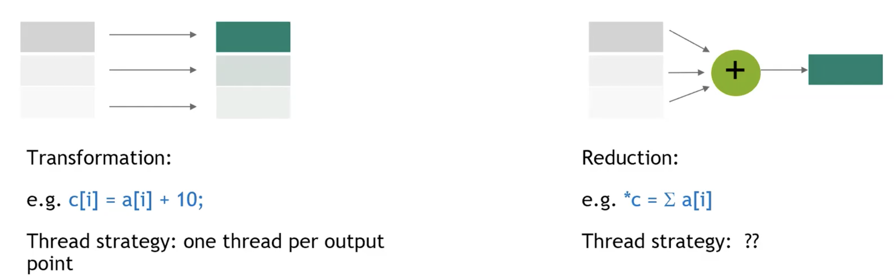
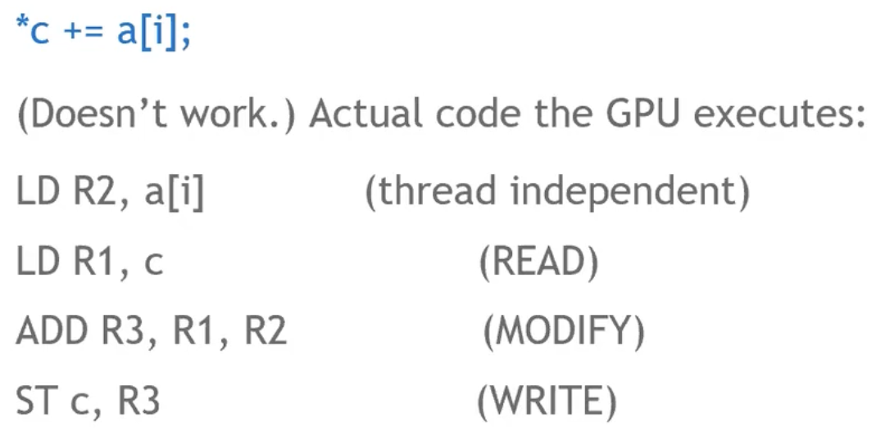
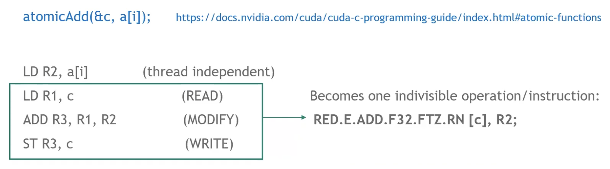
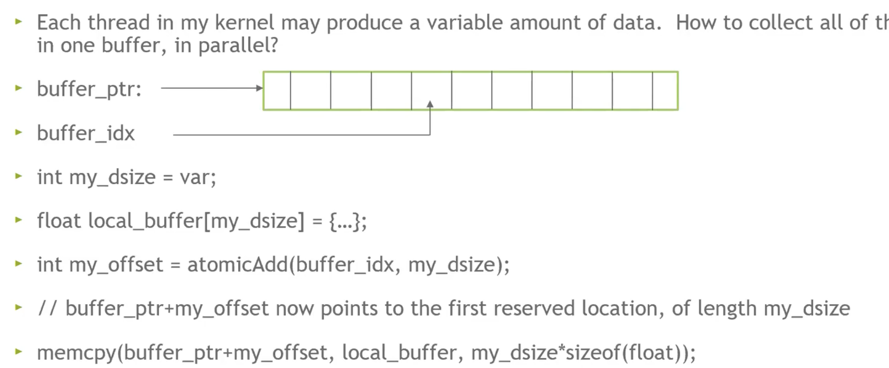
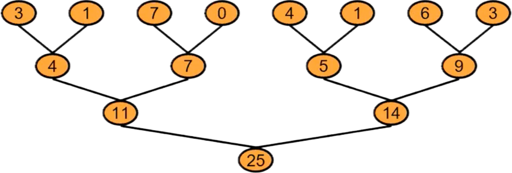
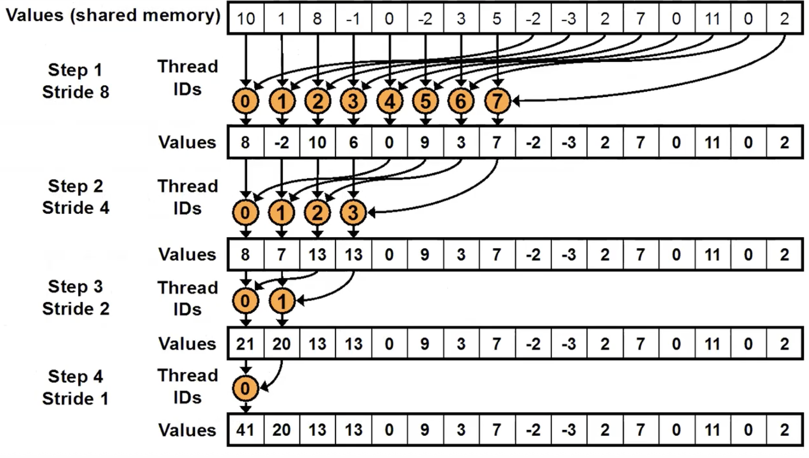

# lec4-Atmoics, Reductions and Warp Shuffle

上一节课涉及的是gpu中存储子系统的使用，而这节课的内容我们更多来看算法调度层面上，如何让gpu，或者说warp内的thread准确高效地工作。

## 什么是Reduction

将我们解决的问题按输入和输出的规模分为Transformation和Reduction两类：



Transformation的输入和输出规模相同，常见的比如向量加法；

Reduction类的问题则是指输出的规模远小于输入规模，比如向量内所有分量的加法。

前者在利用每个thread进行并行方面很明显，每个thread负责一个分量，做加法就可以，而Reduction是否也可以如法炮制？这个是我们需要仔细思考的。

## 什么是atmoics

先来看看假设把这个任务非常简单地分给每个thread的时候，一个thread上世纪运行的machine-code(-like)



类似CPU中的不同步问题，可以看到第二步LD和第四步ST有很严重的冲突隐患。GPU同样是不规定thread间程序执行的具体顺序区分的，那么我们怎么保证一定是一个thread把c取出，加完，放回去，然后下一个thread再加呢？（Bytheway，这样的话并行的优越性也失去了，这个后面会讲



于是我们引入原子操作atomic，本质上其实是把类似这个问题中的一个“Read-Modify-Write”操作序列合并成一个不可分割的整体，从而保证程序的正确运行。之所以叫“原子”，大概是因为化学上“原子”的不可再分的结构，和CPU中的原子操作都是类似的。

当然不难发现在上面的问题中使用原子操作的话，会产生“伪并行”，顺序的强制实际上让整个程序陷入一个串行瓶颈，这个暂时不重要，我们先保证逻辑和结果正确。

比如一个`atomicAdd(&x, 1)`，实际上就是硬件提供的一把“锁 + 操作”的组合指令，实现了：

- 从x地址出取出值. 
- x+=1. 
- 将结果写回x. 

gpu本身在硬件上实现了这些一系列的原子操作，一些基础的运算操作都有其对应的atomics。

除了这样一种累加的场景，原子操作也可以用于工作序列的iterate：

```c
int my_position = atomicAdd(order, 1);
```

一般来说很多原子操作会默认返回操作位置的旧值，也即原子操作将其更新之前的值。所以这里其实可以用于产生一个工作序列。



此外也可以用于这样一种read-buffer的场景，总之是发挥了其不可分的作用来保证顺序正确。

## 怎么并行



其实很自然的想到用这样一种树状操作来满足并行的需求，这跟堆排之类的算法的思想是很像的。

理论上我们希望gpu每次都并行操作完这棵树的一整层，然后处理下一层，这样子我们将时间开销缩短到对数级。问题是我们怎么做thread间的同步锁？

课上提出了这么几种解决思路：

- 为每层任务启动不同的内核，因为内核会按其启动顺序严格时间序列化执行
- 在每次thread-block level的reduction操作时使用原子操作来保证其顺序
- 用一个threadblock-draining的方法（暂不提
- 用一个cooperative-group的方法（暂不提

我们使用第二种方法来详细讨论：



树状思路如上图所示，实现为：

```c
for (unsigned int s=blockDim.x/2; s>0; s>>=1) {
    if (tid<s) {
        sdata[tid] += sdata[tid + s];
    }
    __syncthreads(); //outside the if statement
}
```

注意到一个warp中的threads可以完美分配到32个banks中，所以不用考虑银行的冲突问题。

但是这里我们只能处理有限规模的数组，当初始数组的规模更大的时候，同一个thread内将会需要处理多个数字，因此我们先一步将其加起来，那么实际上可以看作一个grid-stride-loops,这里的stride是一整个grid的thread数目。本质上也可以看作一种提前“聚合”的行为。

```c
int idx = threadIdx.x + blockDim.x * blockIdx.x;
while (idx < N) {
    sdata[tid] += gdata[idx];
    idx += gridDim.x * blockDim.x;
}
```

同时在每一个block加完之后，用先前提到的串行原子加即可。完整的代码如下：

```c
__global__ void reduce_a(float* gdata, float* out)
{
    __shared__ float sdata[BLOCK_SIZE];
    int tid = threadIdx.x;
    sdata[tid] = 0.0f;
    size_t idx = threadIdx.x + blockDim.x * blockIdx.x;

    while (idx < N) {
        sdata[tid] += gdata[idx];
        idx += gridDim.x * blockDim.x;
    }
    
    for (unsigned int s=blockDim.x/2; s>0; s>>=1) {
        __syncthreads(); 
        if (tid<s) {
            sdata[tid] += sdata[tid + s];
        }
    }

    if (tid == 0) atomicAdd(out, sdata[0]);

}
```

## Warp Shuffle

先前我们已经提到过，一根warp内的所有线程可以通过共享内存通信，但这样的通信流程离不开一次存和一次取，有没有什么更简单更直接的通信方式呢？（有的兄弟有的

warp shuffle，如其名，进行一个打乱洗牌。这里打乱的是寄存器中的内容的位置，通过一条硬件链路，根据一定的规则来更换寄存器中的值，可以理解成抄作业。

来看一个简单的示例：

```c
int lane = threadIdx.x & 31;     
float x  = ...;                      // 当前线程自己的值
float y  = __shfl_sync(mask, x, src_lane, 32);
```

这里`__shfl_sync`具体做的事情是：

- 将自己的x放进可交换的池子中
- 从池子中找到src_lane对应的值存到y里

mask的作用则是声明所有参与shuffle的线程，一般使用`0xffffffff`，全32线程参与。

注意warp-shuffle只能对同时参与到`__shfl_sync`这里面的所有线程放入的值进行互换，而这样的互换在时间上可以视作同步，非常高效。

而根据换取的idx的产生规则的不同也诞生了这些内置函数：

- `__shfl_sync()` Direct copy from indexed lane
- `__shfl_up_sync()` Copy from a lane with lower ID relative to caller
- `__shfl_down_sync()` Copy from a lane with higher ID relative to caller
- `__shfl_xor_sync()` Copy from a lane based on bitwise XOR of own lane ID

大概就是不同的“洗牌”方式。

那么我们可以用ws来改写前面的树状求和：

```c
__global__ void reduce_ws(float* gdata, float* out)
{
    __shared__ float sdata[32];
    int tid = threadIdx.x;
    int idx = threadIdx.x + blockDim.x * blockIdx.x;
    float val = 0.0f;
    unsigned mask = 0xFFFFFFFFU;
    int lane = threadIdx.x % warpSize;
    int warpID = threadIdx.x / warpSize;
    while (idx < N)
    {
        val += gdata[idx];
        idx += gridDim.x * blockDim.x;
    }
    // First warp-shuffle reduction

    for (int offset = warpSize/2; offset > 0; offset >>=1)
    {   val += __shfl_down_sync(mask, val, offset);}

    if (lane == 0) {sdata[warpID] = val;} // 第一次各warp内加和完成之后将每个warp的第一个thread的结果（即内加和结果）存储到共享内存
    __syncthreads();

    if (warpID == 0){
        val = (tid < blockDim.x / warpSize) ? data[lane] : 0; // 只在第一个warp中加载，并再做shuffle
        for (int offset = warpSize / 2; offset > 0; offset >>= 1) {
            val += __shfl_down_sync(mask, val, offset);
        }
        if (tid == 0) atomicAdd(out, val);
    }
    // 支持每个block内32x32大的数组的加和
}

```


