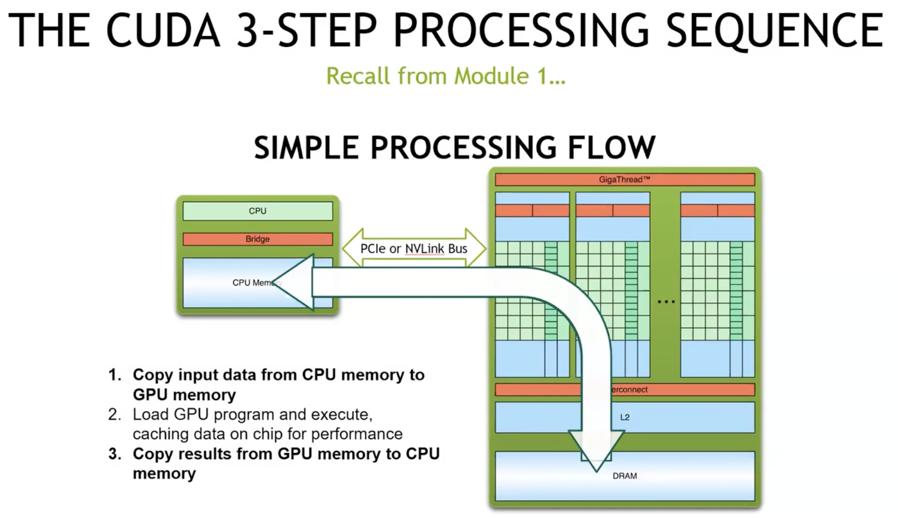
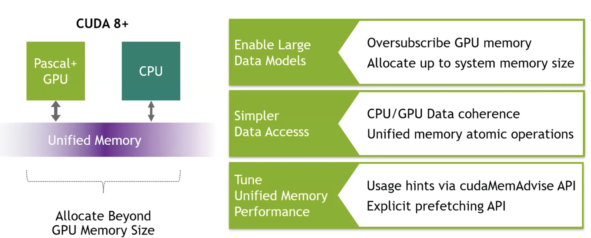
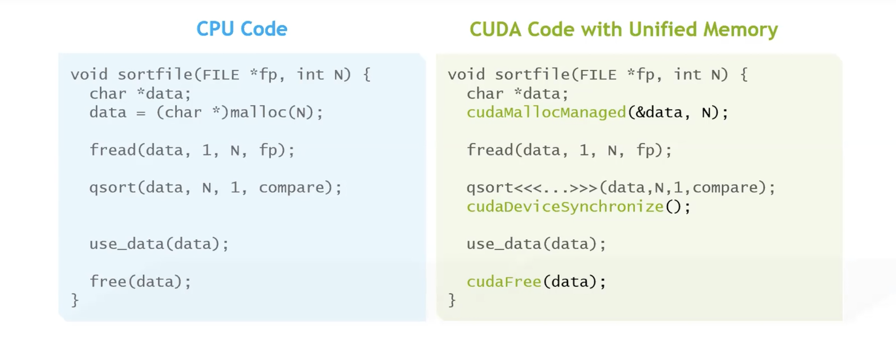
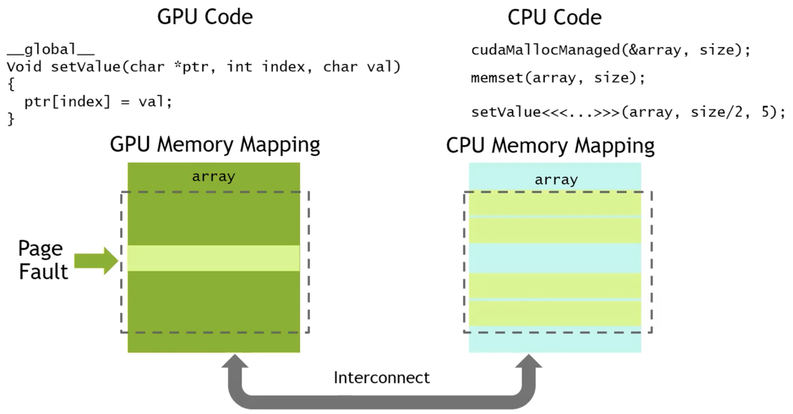
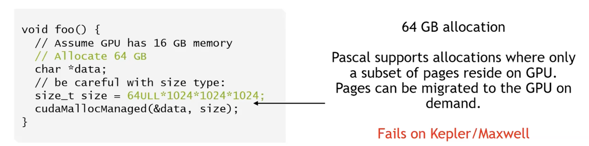
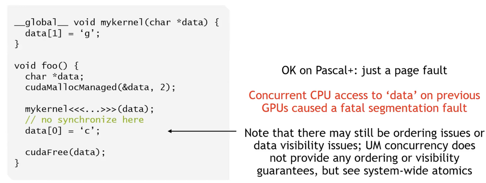
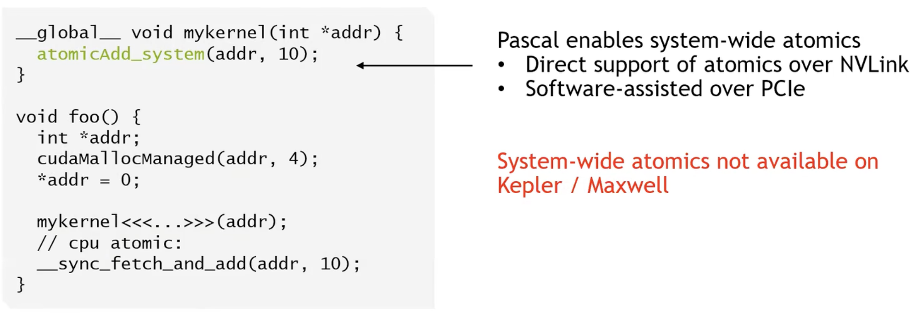
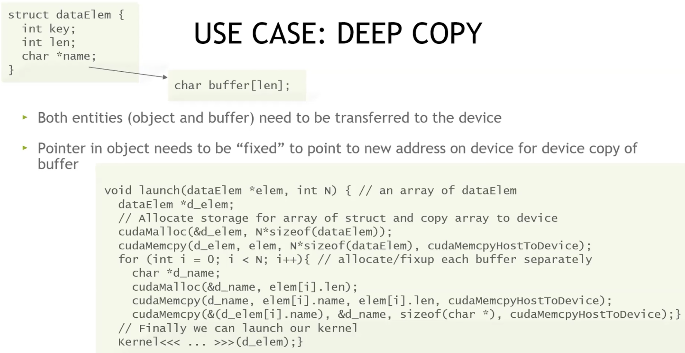
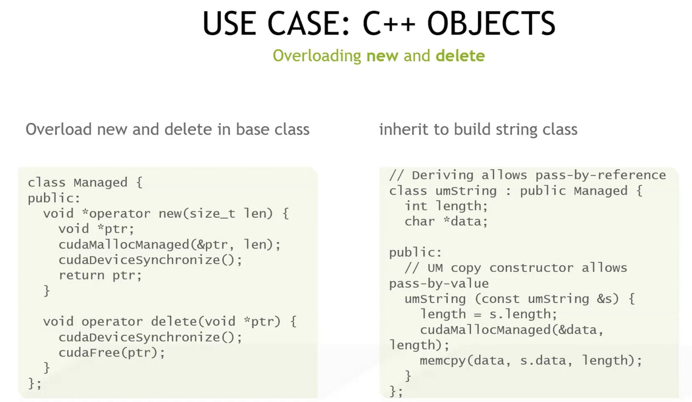

# lec6-Managed Memory

首先明确一下这个概念，Managed Memory实际上和Unified Memory，也即统一内存是同一个东西，至于为什么叫这个名字，单纯是因为cuda里的api实现时名字带了个Managed，所以也叫Managed Memory。



简单回顾一下我们传统意义上的3-step的处理流程，第一步和第三步都需要做一个内存上的搬运。所以会想到，如果将这部分封装成一个“统一内存”，使得在host和device上都可以直接access到，那么从编程的角度来看就相当方便。

## Unified Memory

这个课程比较久远，现在大概已经又进化了不少了吧（总之先看看当时的内存架构：



可以看到，在统一内存的基础上，我们可以允许给gpu分配大于其实际物理内存的内存（意味着其实并不是全在gpu上），从而加载更大的模型。同时在CPU和GPU中数据的协同，以及其上的原子操作都更加的方便。这里还涉及到运行性能的微调，这个后面的课才会讲到。



在统一内存管理下，数据的存取更方便了。右边的代码和左边对比，将原本的cpu-malloc换成了managed-malloc，然后加入了一步synchronize来保证gpu上的同步，最后free换成cudafree。



这张图就已经足够很好地诠释unified memory的大致实现方法。

假设我们现在mallocmanaged和memset了，这个时候实际是在cpu内存上开了一块空间然后写入数据，这个时候我们调用一个gpu上的setValue，此时gpu的页表中没有对应的mapping，所以会报一个on-demand pagefault。然后会在总线上进行一个数据的迁移，物理意义上的将SetValue所需要的这部分（在gpu上应当被看作是line）从cpu上复制到gpu上，如图所示，只物理拷贝了一行。当然数据迁移之后也完成对应的页表映射。

随后我们的gpu就能正常使用这个unified memory的映射去完成任务。这个时候如果cpu又需要access这部分修改过的内容呢？在gpu侧进行写入之后，这一部分的项目会被标记为过时 dirty，因此当cpu需要的时候，会倒反天罡从Gpu处把这一部分数据物理迁移回来，从而保证内存的一致性。

嗯...这样子一直换页似乎开销很大，这和原来的每次的memcopy似乎也没什么区别？（后面有进一步的优化稍安勿躁之

## 用处



前面提到的“虚假”内存分配，允许gpu使用更多的内存。至于如何使用，从前面的缺页机制来看，应该也是有在内存满时的一些换入换出的机制，这里没有细讲。



这里提到的是，虽然UM允许我们去方便地在cpu和gpu内存中切换访问，但是如果像上面这里一样，使用完gpu之后没有加入同步原语，那么就会产生cpu和gpu的重叠访问导致bug，这里会直接call segmentation fault。



system-wide atomics 是指对某个内存位置的原子操作，其原子性和内存顺序保证在整个系统范围内生效，包括：

- 当前 GPU 的所有线程/blocks. 
- 其他 GPU（在共享/统一地址空间场景）. 
- CPU 线程. 

相对的，普通 device-scope atomics 只保证 GPU 内部原子，对 CPU 或其他 GPU 不提供一致性保证。system-wide 原子适合在 CPU/GPU、多 GPU 间共享计数器、标志位或锁等场景，但代价明显更高，因此应只用于必要的跨设备同步，频繁高并发的累加仍应优先用 device-scope + 分层汇总。



一种常见的应用是做deepcopy。假设有一个c-struct长左上角这样，如果只是int元素，那么根本不需要deepcopy，数据的迁移已经由UM实现。但是如果需要真正的在UM空间中做deepcopy，那么除了int值，我们的指针所指向的数据也要取出一份，然后deepcopy一份粘贴到新位置。也就是，我们在简单的拷贝了结构体之后，还要修一下我们的指针，让他也指向一个新的但是数据和原来一样的空间。这就涉及到一个额外的mallocmanaged过程。



这一块则是通过重载我们的new和delete来更方便的实现UM上的操作。


不得不说图计算从UM中受益许多，后者允许我们加载一个很大的图并在上进行运算。至于原因也很简单，我们不需要在gpu中加载整个图，而是通过on-demand paging的方式按需取点，比如当我们在图上做bfs遍历的时候，每次都只有邻近点的处理需求，这个时候将其加载到gpu上就行。借此我们可以大大提升图处理的性能。

## 调优

前面也说过，单纯的依赖page-fault换页是很蠢的，特别是当换入的内容太大，而且很多无效信息的时候，其性能甚至不如我像一开始一样做单纯的memcpy。所以我们需要一些调优机制。

首先是prefetch：

```c
cudaError_t cudaMemPrefetchAsync(
    const void* devPtr, size_t count,
    int dstDevice, cudaStream_t stream = 0);
```

cuda为我们提供了这样一个手动prefetch的选项。一方面，它支持我们手动选择一部分内存进行迁移，比如提前从cpu迁移到gpu，这样就可以节省page-fault环节产生的额外开销。另一方面，它是一个异步的操作，可以在另一个cudastream上与我们的计算并行，不会额外占用时间。

除此之外，我们也可以给runtime一些advise，它们会调整runtime管理UM的一些倾向和方式，课程内提到有以下几种advise:

- `cudaMemAdvise(ptr, size, cudaMemAdviseSetPreferredLocation, device);` 说明这块内存要长期放在device上，runtime会尽量将其主要副本放在这个设备的内存中. 
- `cudaMemAdvise(ptr, size, cudaMemAdviseSetReadMostly, 0);` 说明这部分内存大部分时候都是只读，所以可以创建大量副本，进行更积极的复制，不用顾虑写回的开销
- `cudaMemAdvise(ptr, size, cudaMemAdviseSetAccessedBy, device);` 这是一个访问的提前预告，runtime会在后台做额外映射或提前准备，避免第一次访问时的某些开销（比如建立页表映射）

## UM&ATS&HMM

- UM（Unified Memory）：CUDA 的软件抽象 + runtime 机制。让你用一个指针在 CPU/GPU 间共享数据，不用手写 cudaMemcpy。关键实现手段：按需分页 + 页迁移 + 提示（prefetch/advise）。

- ATS（Address Translation Services）：硬件/总线协议级支持（PCIe 功能），允许设备（GPU）发起内存访问时，向 CPU 的 IOMMU 请求 CPU 虚拟地址的翻译。使得GPU 能直接用 CPU 虚拟地址访问 host 内存（零拷贝 + 更好的一致性基础）。

- HMM（Heterogeneous Memory Management）：Linux 内核的异构内存管理框架，让 CPU & 设备共享统一的虚拟地址空间与页表，支持设备页 fault 回调、与内核的统一内存管理。给像 NVIDIA/AMD 这种驱动提供“OS 级支撑”。

所以实际上ATS和HMM是在底层给UM擦屁股。更详细地说：ATS 在总线层提供 VA 翻译能力，HMM 在内核层接手页表与页 fault 管理，UM 在 CUDA 层利用这套能力，对开发者暴露简单的统一内存 API 与高层迁移策略。
